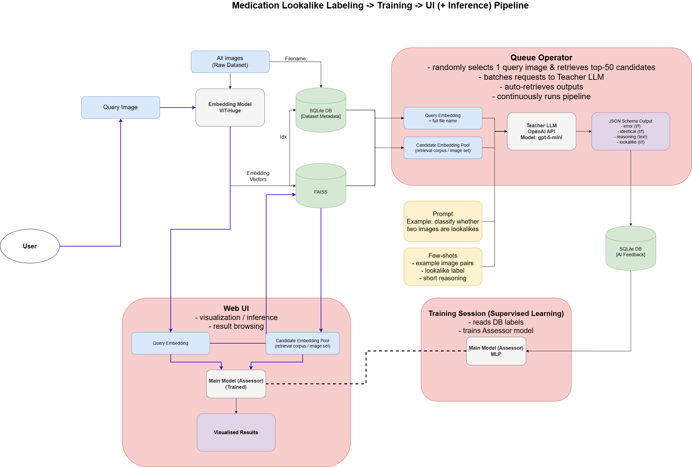

# AI4H Oral 1

Lookalike medication identification system built around:

- `ViT` image embeddings
- `FAISS` candidate retrieval
- `Assessor MLP` binary lookalike scoring
- `FastAPI` backend
- `React + Vite` web UI
- AI-augmented labeling pipeline
- optional online feedback / replay-buffer training loop

The project is not a single-model demo. It is a pipeline with separate stages for:

- image embedding
- retrieval corpus construction
- dataset metadata tracking
- AI-assisted label generation
- supervised assessor training
- web inference and online feedback

## Pipeline Overview



At a high level, the system works like this:

1. Raw medication images in `input_img/` are embedded with the ViT model.
2. The embedding vectors are stored as `.pt` files in `data/embeddings/`.
3. Those vectors are indexed into `data/faiss/embeddings.index`, while file-level metadata is synced into `data/sqlite/ai4h.db`.
4. The retrieval corpus is reused by the AI augmentation pipeline, where an operator script samples a query image, retrieves top-k candidates, sends query/candidate pairs to a teacher LLM, and stores JSON-labeled outputs in SQLite.
5. The assessor model is trained either from human annotation Excel files or from `ai_augment_feedback` rows stored in SQLite.
6. The FastAPI backend embeds an uploaded query, retrieves candidates from FAISS, scores them with the trained assessor, and returns lookalike / non-lookalike results to the web UI.

This separation matters:

- FAISS is the retrieval layer
- SQLite is the metadata and feedback store
- the assessor is the final pair classifier

## What The System Does

Given a medication image:

1. A ViT model converts the image into an embedding.
2. FAISS retrieves visually similar candidates from the corpus.
3. The assessor model scores each query-candidate pair.
4. The UI/API splits results into `lookalikes` and `non-lookalikes` using a threshold.

Important:

- retrieval similarity is not the final decision
- cosine / L2 / inner-product are retrieval modes
- the assessor is the actual lookalike classifier
- SQLite keeps the name/vector-id/feedback relationships needed to interpret FAISS results

## Repository Layout

```text
.
├── assessor/                # Assessor model code, checkpoints, evaluation outputs
├── data/
│   ├── Annotation/          # Excel/PDF annotations
│   ├── embeddings/          # Precomputed image embeddings (.pt)
│   ├── faiss/               # FAISS index
│   └── sqlite/              # SQLite metadata DB
├── data_augmentation/       # Batch generation / AI feedback import utilities
├── image_embedding/         # ViT embedding code
├── scripts/                 # Training / eval helper scripts
├── test_query_img/          # Held-out query images and GT csv
├── web_ui/
│   ├── api.py               # FastAPI server
│   └── frontend/            # React + Vite frontend
├── train.py                 # Main assessor training entrypoint
├── train_online.py          # Online training loop with prioritized replay
└── utils.py                 # FAISS / SQLite retrieval helpers
```

## Embedding, FAISS, And SQLite Build Process

The retrieval corpus is built in two steps.

### 1. Image -> embedding files

[image_preprocess.py](/home/emfor/ai4h_oral1/image_preprocess.py) scans `input_img/`, embeds each image with ViT, and writes one `.pt` file per image into `data/embeddings/`.

```bash
uv run python image_preprocess.py
```

Properties:

- input root: `input_img/`
- output root: `data/embeddings/`
- each `.pt` file is a single 1D embedding tensor
- embedding filenames are used later for annotation matching and DB sync

### 2. Embedding files -> FAISS + SQLite

[data/embedding_to_db.py](/home/emfor/ai4h_oral1/data/embedding_to_db.py) loads every `.pt` embedding, stacks them into a matrix, writes the FAISS index, and syncs the SQLite metadata table.

```bash
uv run python data/embedding_to_db.py
```

What it creates:

- `data/faiss/embeddings.index`
- `data/sqlite/ai4h.db`

How IDs are assigned:

- embeddings are enumerated in sorted filename order
- that integer becomes `vector_id`
- the same `vector_id` is used in both FAISS and SQLite

Operationally:

- FAISS stores vectors and supports nearest-neighbor search
- SQLite maps each `vector_id` back to a filename and stores feedback / labels / training logs
- retrieval code combines both to return `(vector_id, score, vector, file_name)` instead of raw vectors only

## SQLite Schema And Data Roles

The SQLite database is not just a cache. It is the glue between retrieval, labeling, online feedback, and AI-generated training data.

### Core tables

`image_db`

- defined in [data/embedding_to_db.py](/home/emfor/ai4h_oral1/data/embedding_to_db.py) and [data/schema.py](/home/emfor/ai4h_oral1/data/schema.py)
- one row per embedding / corpus image
- current columns:
  - `id`
  - `vector_id`
  - `file_name`
  - `med_name`
  - `volume`
  - `image_type`

Role:

- canonical mapping from FAISS `vector_id` to image filename
- used whenever the API or training code needs to reconstruct which image a retrieved vector refers to

`lookalike_graph`

- defined in [data/schema.py](/home/emfor/ai4h_oral1/data/schema.py) and [train_online.py](/home/emfor/ai4h_oral1/train_online.py)
- columns:
  - `id`
  - `base_id`
  - `similar_id`

Role:

- stores positive lookalike edges between `image_db.id` rows
- populated during online feedback ingestion when a pair is labeled positive

### Online training tables

`online_feedback`

- created by [train_online.py](/home/emfor/ai4h_oral1/train_online.py)
- current columns:
  - `id`
  - `label`
  - `query_vector_id`
  - `candidate_vector_id`
  - `query_file_name`
  - `candidate_file_name`
  - `retrieval_score`
  - `model_score`
  - `created_at`

Role:

- stores manual labels collected from the online-training UI
- acts as persistent history for replay hydration and audit

`online_train_log`

- created by [train_online.py](/home/emfor/ai4h_oral1/train_online.py)
- current columns:
  - `id`
  - `step_count`
  - `batch_size`
  - `loss`
  - `created_at`

Role:

- stores incremental online training events and losses

### AI augmentation table

`ai_augment_feedback`

- created by [data_augmentation/batch_retriever.py](/home/emfor/ai4h_oral1/data_augmentation/batch_retriever.py)
- current columns:
  - `id`
  - `batch_id`
  - `custom_id`
  - `query_image_name`
  - `candidate_image_name`
  - `query_vector_id`
  - `candidate_vector_id`
  - `label`
  - `error`
  - `identical`
  - `reasoning`
  - `response_id`
  - `request_id`
  - `created_at`

Role:

- stores LLM-generated pair labels plus reasoning
- used by the AI-feedback browser in the frontend
- can be used as supervised training data by [train_ai_feedback.py](/home/emfor/ai4h_oral1/train_ai_feedback.py)

## Data Dependencies

This repo assumes local assets already exist.

Required files/directories:

- `data/embeddings/` for corpus embeddings
- `data/faiss/embeddings.index` for retrieval
- `data/sqlite/ai4h.db` for vector/file metadata and online feedback tables
- medication source images under `input_img/`

Without those assets, the API and most evaluation scripts will not run.

## Environment Setup

Linux is the intended environment. The old README explicitly asked for Linux / WSL, and the current `uv` config is also Linux-only.

Python:

- `>=3.11,<3.12`

Install dependencies:

```bash
uv sync --extra cu124
```

CPU-only install:

```bash
uv sync --extra cpu
```

Frontend install:

```bash
cd web_ui/frontend
npm install
```

## Core Models

### 1. Image embedding model

- implemented in [image_embedding/vit.py](/home/emfor/ai4h_oral1/image_embedding/vit.py)
- used to embed uploaded query images
- output embedding size is expected to be `1280`

### 2. Assessor model

- implemented in [assessor/model.py](/home/emfor/ai4h_oral1/assessor/model.py)
- scores a `(query_embedding, candidate_embedding)` pair
- outputs a probability-like score in `[0, 1]`

The training code describes the representation as a pairwise MLP over embedding interactions, not simple nearest-neighbor matching.

### Current best model in this repo

For the current backend setup, the main deployed / default model family is:

- `assessor/model_ai_feedback_h2048_1024_512`

The backend default checkpoint is:

- `assessor/model_ai_feedback_h2048_1024_512/assessor_best_f1.pt`

Based on the stored sweep results in [assessor/evaluate_results.csv](/home/emfor/ai4h_oral1/assessor/evaluate_results.csv), the best tested decision threshold for this model family was:

- `threshold = 0.9`

For the default checkpoint `assessor_best_f1.pt`, recorded F1 across tested thresholds was:

- `0.5 -> 0.01480`
- `0.6 -> 0.01549`
- `0.7 -> 0.01688`
- `0.8 -> 0.01962`
- `0.9 -> 0.02513`  ← best among tested values

For the plain `assessor.pt` checkpoint in the same directory, recorded F1 was:

- `0.5 -> 0.02316`
- `0.6 -> 0.02469`
- `0.7 -> 0.02785`
- `0.8 -> 0.03237`
- `0.9 -> 0.04457`  ← best among tested values

These values come from the saved evaluation CSV and should be treated as the documented best threshold among the thresholds that were actually swept in that run.

## Running The App

### Backend

From project root:

```bash
uv run uvicorn web_ui.api:app --reload --host 0.0.0.0 --port 8000
```

Custom checkpoint:

```bash
ASSESSOR_CHECKPOINT_PATH=assessor/model_ai_feedback_h2048_1024_512/assessor_best_f1.pt \
uv run uvicorn web_ui.api:app --reload --host 0.0.0.0 --port 8000
```

Health check:

```bash
curl http://127.0.0.1:8000/health
```

### Frontend

In another terminal:

```bash
cd web_ui/frontend
npm run dev
```

Open:

- `http://localhost:5173/` for online training
- `http://localhost:5173/inference` for inference (MAIN FEATURE)
- `http://localhost:5173/replay_buffer` for replay buffer inspection (Online Training)
- `http://localhost:5173/ai_feedback_retriever` for imported AI feedback browsing (Supervised Learning with AI-gen data)

## API Overview

Main endpoints in [web_ui/api.py](/home/emfor/ai4h_oral1/web_ui/api.py):

- `GET /health`
- `POST /inference/predict`
- `POST /online/session/init`
- `GET /online/session/next`
- `POST /online/session/submit`
- `GET /online/image/{vector_id}`
- `GET /online/replay_buffer`
- `GET /ai_feedback/queries`
- `GET /ai_feedback/by_query`

### Inference flow

`POST /inference/predict`:

- accepts an uploaded image
- embeds it with ViT
- retrieves top-k candidates from FAISS
- scores them with the assessor
- returns separate `lookalikes` and `non_lookalikes`

Key query params:

- `top_k` default `20`
- `similarity_type` in `l2`, `ip`, `cosine` and aliases
- `threshold` default `0.5`

## Training Modes

There are two different training stories in this repo.

### 1. Offline assessor training

Main entrypoints:

- [train.py](/home/emfor/ai4h_oral1/train.py)
- [scripts/train_model_v3.py](/home/emfor/ai4h_oral1/scripts/train_model_v3.py)

Typical command:

```bash
uv run python scripts/train_model_v3.py --annotation-file data/Annotation/data_reformatted.xlsx
```

Useful options:

```bash
uv run python scripts/train_model_v3.py --epochs 25 --batch-size 32 --out-dir assessor/model_v3
```

What it uses:

- annotation Excel files under `data/Annotation/`
- resolved embedding pairs from `data/embeddings/`
- pairwise BCE training

If you want to train directly from AI-generated labels stored in SQLite, use:

```bash
uv run python -m train_ai_feedback --out-dir assessor/model_ai_feedback
```

That path reads from `ai_augment_feedback` instead of Excel annotations.

### 2. Online feedback training

Main entrypoint:

- [train_online.py](/home/emfor/ai4h_oral1/train_online.py)

The web UI supports:

- random query selection from the DB
- candidate retrieval
- manual lookalike / non-lookalike labeling
- online replay-buffer accumulation
- short incremental fine-tuning steps

The replay buffer is prioritized and exposes `alpha`, `beta`, and recent-sample bias controls.

## Annotation Workflow

The repo already includes a streamlined annotation workflow.

Reformat annotation source:

```bash
uv run python scripts/reformat_lookalike_to_testdata.py
```

Inspect resolved pairs:

```bash
uv run python scripts/show_annotation_pairs.py --annotation-file data/Annotation/data_reformatted.xlsx
```

Expected streamlined format:

- one sheet per query
- `Lookalike` column
- `Non lookalike` column

## Evaluation

Main evaluation scripts:

- [scripts/eval_on_test_data.py](/home/emfor/ai4h_oral1/scripts/eval_on_test_data.py)
- [scripts/compare_models.py](/home/emfor/ai4h_oral1/scripts/compare_models.py)
- [assessor/evaluate.py](/home/emfor/ai4h_oral1/assessor/evaluate.py)

Examples:

```bash
uv run python scripts/eval_on_test_data.py --model-dir assessor/model_v3 --test-data data/Annotation/data_reformatted.xlsx
```

```bash
uv run python scripts/compare_models.py --model-a assessor/model --model-b assessor/model_v3
```

`assessor/evaluate.py` is broader. It can evaluate checkpoints against `test_query_img/` ground truth and supports multiple retrieval modes and top-k settings.

## AI Feedback / Data Augmentation Utilities

The `data_augmentation/` directory contains scripts for batch-oriented augmentation and feedback import, including:

- batch generation
- retrieval
- upload helpers
- import of AI-generated lookalike judgments into SQLite

The frontend page `/ai_feedback_retriever` reads from the `ai_augment_feedback` table when that table exists.

## Known Caveats

### Assessor checkpoint path

The backend now reads the assessor checkpoint from `ASSESSOR_CHECKPOINT_PATH`.

Default:

- `assessor/model_ai_feedback_h2048_1024_512/assessor_best_f1.pt`

`config.json` is expected in the same directory as the checkpoint.

### Image roots

The backend resolves corpus images from:

- `input_img/`

If embeddings exist but matching image stems are missing from those directories, image preview URLs will fail.

### Local assets are assumed

This repo does not include a clean bootstrap path for rebuilding everything from raw data. It expects existing embeddings, FAISS index, SQLite DB, and trained checkpoints.

## Quick Command Reference

```bash
# install
uv sync --extra cu124
cd web_ui/frontend && npm install

# backend
uv run uvicorn web_ui.api:app --reload --host 0.0.0.0 --port 8000

# backend with explicit checkpoint
ASSESSOR_CHECKPOINT_PATH=assessor/model_ai_feedback_h2048_1024_512/assessor_best_f1.pt \
uv run uvicorn web_ui.api:app --reload --host 0.0.0.0 --port 8000

# frontend
cd web_ui/frontend
npm run dev

# reformat annotations
uv run python scripts/reformat_lookalike_to_testdata.py

# inspect annotation pairs
uv run python scripts/show_annotation_pairs.py --annotation-file data/Annotation/data_reformatted.xlsx

# train assessor
uv run python scripts/train_model_v3.py --annotation-file data/Annotation/data_reformatted.xlsx

# evaluate
uv run python scripts/eval_on_test_data.py --model-dir assessor/model_v3 --test-data data/Annotation/data_reformatted.xlsx
```
